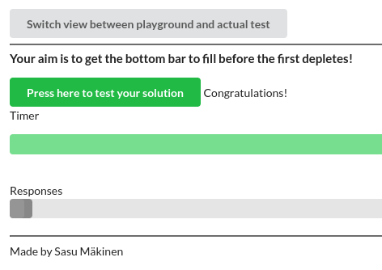

First I used command:

```bash
docker-compose up -d --scale compute=3
```

and the bottom bar filled easily before the first on depleted, so I tried also:

```bash
docker-compose up --scale compute=2
```


