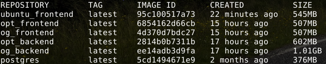

## Backend

Original backend image, **1.01GB**, Dockerfile:

```Dockerfile
FROM golang:1.16-buster

WORKDIR /app

COPY . /app

EXPOSE 8080

ENV REQUEST_ORIGIN=http://localhost:5000

RUN go build

RUN useradd -m backend

USER backend

CMD ./server
```

Optimized backend image from `ubuntu:18.04`, **602MB**, Dockerfile:

```Dockerfile
FROM ubuntu:18.04

WORKDIR /app

COPY . /app

ENV PATH="/usr/local/go/bin:${PATH}"

RUN apt-get update && apt-get install -y wget && \
    wget https://go.dev/dl/go1.16.linux-amd64.tar.gz && \
    tar -C /usr/local -xzf go1.16.linux-amd64.tar.gz && \
    rm -rf go1.16.linux-amd64.tar.gz && \
    apt-get purge -y --auto-remove wget && \
    rm -rf /var/lib/apt/lists/* && \
    go build && \
    find . ! -name 'server' ! -name '.' ! -name '..' -type f,d -exec rm -rf {} + && \
    useradd -m backend

USER backend

CMD ./server
```

### Notes

I didn't reach the given 350MB and I don't really understand how it should be done without using Alpine and/or multi-stage builds, which we'll face in the material just after this exercise. I asked about this in the course Telegram channel, but it said to be more important that one at least tries to reach that. Anyway, I still would like to hear how to achieve that ~350MB without Alpine nor multi-stage builds. :D

## Frontend

Original frontend image, **507MB**, Dockerfile:

```Dockerfile
FROM node:16-bullseye-slim

WORKDIR /app

COPY . /app

EXPOSE 5000

ENV REACT_APP_BACKEND_URL=http://localhost:8080

RUN npm install
RUN npm run build
RUN npm install -g serve

RUN useradd -m frontend

USER frontend

CMD [ "serve", "-s", "-l", "5000", "build" ]
```

Frontend image from `ubuntu:18.04`, **545MB**, Dockerfile:

```Dockerfile
FROM ubuntu:18.04

WORKDIR /app

COPY . /app

EXPOSE 5000

ENV REACT_APP_BACKEND_URL=http://localhost:8080

RUN apt-get update && apt-get install -y curl && \
    curl -sL https://deb.nodesource.com/setup_16.x | bash && \
    apt-get install -y nodejs && \
    npm install && npm run build && \
    npm install -g serve && \
    apt-get purge -y --auto-remove curl && \
    rm -rf /var/lib/apt/lists/* && \
    useradd -m frontend

USER frontend

CMD [ "serve", "-s", "-l", "5000", "build" ]
```

Optimized frontend image, **507MB**, Dockerfile:

```Dockerfile
FROM node:16-bullseye-slim

WORKDIR /app

COPY . /app

EXPOSE 5000

ENV REACT_APP_BACKEND_URL=http://localhost:8080

RUN npm install && npm run build && \
    npm install -g serve && \
    useradd -m frontend

USER frontend

CMD [ "serve", "-s", "-l", "5000", "build" ]
```

### Notes

I didn't reach the 432MB neither. I originally used the `node:16-bullseye-slim` as base image, which is lightweight Debian as base for the official Node, so I think it is already very optimized and thus it is hard to beat that, when one has just started learning the whole optimization thing. I am not very familiar with NodeJS neither, so I don't know if it's possible to install some more lightweight way or something and is it possible to remove some files after building etc.

