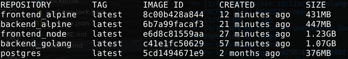

## Backend

Image with just `golang:1.16`, **1,07GB**, Dockerfile:

```Dockerfile
FROM golang:1.16

WORKDIR /app

COPY . /app

EXPOSE 8080

ENV REQUEST_ORIGIN=http://localhost:5000

RUN go build && useradd -m backend

USER backend

CMD ./server
```

Image with `golang:1.16.15-alpine3.15`, **447MB**, Dockerfile:

```Dockerfile
FROM golang:1.16.15-alpine3.15

WORKDIR /app

COPY . /app

EXPOSE 8080

ENV REQUEST_ORIGIN=http://localhost:5000

RUN go build && adduser -D backend

USER backend

CMD ./server
```

## Frontend

Image with just `node:16`, **1.23GB**, Dockerfile:

```Dockerfile
FROM node:16

WORKDIR /app

COPY . /app

EXPOSE 5000

ENV REACT_APP_BACKEND_URL=http://localhost:8080

RUN npm install && npm run build && \
    npm install -g serve && \
    useradd -m frontend

USER frontend

CMD [ "serve", "-s", "-l", "5000", "build" ]
```

Image with `node:16-alpine3.15`, **431MB**, Dockerfile:

```Dockerfile
FROM node:16-alpine3.15

WORKDIR /app

COPY . /app

EXPOSE 5000

ENV REACT_APP_BACKEND_URL=http://localhost:8080

RUN npm install && npm run build && \
    npm install -g serve && \
    adduser -D frontend

USER frontend

CMD [ "serve", "-s", "-l", "5000", "build" ]
```

## Notes

Using Alpine makes a significant difference in image sizes, and now the frontend image is near to that given as example in the exercise 3.4.

