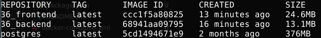
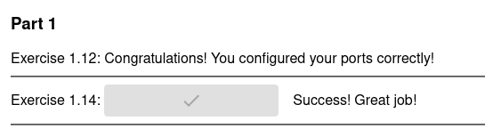

## Dockerfiles

[Backend's Dockerfile](https://github.com/Pekk4/Docker_MOOC/blob/master/Part_3/3.6/backend/Dockerfile)

[Frontend's Dockerfile](https://github.com/Pekk4/Docker_MOOC/blob/master/Part_3/3.6/frontend/Dockerfile)

## Images

## Notes

Got both of images smaller than 25MB, and did the user optimization to backend image, but not in the frontend image. That's because I've used a whole day for this and fairly I don't have enough power/interest/knowledge anymore to do the required changes for nginx configuration about user privileges and port. On the other hand the assignment didn't require touching the user privileges.

First I tried to copy just serve and build/ to another stage in frontend but it didn't work in any way, so I decided to try with nginx and noticed that with Alpine it is pretty small too.

Also had to work a little with those ENV values before I got the application working. Later I decided to map the frontend's port as 5000:80 so I could use the 5000 as ENV value like earlier too and that's why I added docker-compose.yml.

